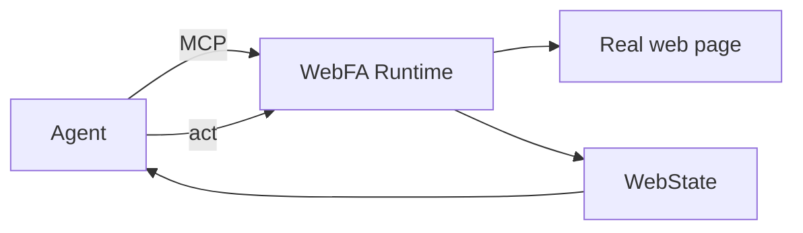

<h1 align="center">
  <picture>
    <source media="(prefers-color-scheme: dark)" srcset="docs/assets/webfa-mark-light.svg">
    
  </picture>
  WebFA
</h1>

<p align="center"><strong>An internet runtime built for agents</strong></p>
<p align="center">Let an agent use the real web as a first-class internet user</p>

<p align="center">
  <a href="LICENSE"></a>
  <a href="https://www.python.org/"></a>
  <a href="https://modelcontextprotocol.io/"></a>
  
</p>

<p align="center">
  <a href="#quick-start">Quick Start</a> ·
  <a href="README.md">中文</a> ·
  <a href="#how-it-works">How It Works</a> ·
  <a href="#safety-boundary">Safety</a> ·
  <a href="#documentation">Docs</a>
</p>

---

WebFA is a local **agent-native browser runtime**: it gives agents a native interface to the web, so they can browse, act on, and verify real websites as first-class internet users.

```text
agent -> webfa.open_url -> webfa.observe -> webfa.act -> webfa.observe
```

The agent makes the decisions; WebFA does the work: opening real pages, keeping website login identities in isolated Profiles, returning structured page state, and executing semantic web-object operations. Human preview UI is not a product goal. Leftover Desktop / Monitor code remains in the tree and is not advertised as a capability.

Status: **Developer Preview**. APIs and behavior may change.

## Why WebFA?

Agents can already write code, edit documents, and make decisions. Using the real internet as a person would is where the usual paths break down:

| Common approach | What you actually get |
| --- | --- |
| Traditional browser + automation | The agent sees DOM, selectors, coordinates, and CDP — brittle when pages change |
| Site-specific APIs / wrappers | Not general web access, and not a real web user |
| Human browser UI at the center | The agent depends on a UI built for people, not its own runtime |

WebFA keeps the engine, Chrome UI, DOM, selectors, and CDP as implementation details. Agents get **web objects, semantic operations, and structured state**.

WebFA is **not**: a traditional browser with automation attached, a collection of site-specific API wrappers, or a desktop app with a built-in agent.

## How It Works

Agents work with **web objects**, not the DOM:

```text
real web page -> WebObjectCompiler -> WebState (WebObjects / Capabilities) -> Agent semantic operations
```



`webfa.observe` returns a structured `WebState`: operable web objects, their state and relations, available operations, document revisions, and change sets. `webfa.act` accepts only the semantic operations declared by objects (e.g. `open`, `set_value`, `submit`, `choose`). DOM, selectors, coordinates, mouse/keyboard events, and CDP are internal Runtime details and never enter the public protocol. Full design: `docs/P10_WEBFA_OBJECT_MODEL_DESIGN.md`.

## Quick Start

Requirements: Python 3.12+, with Chrome or Edge installed locally.

```powershell
python -m venv .venv
.\.venv\Scripts\activate
pip install -e ".[dev]"
webfa doctor        # local self-test
```

Generate an MCP config for your agent:

```powershell
webfa mcp-config --agent-id <your-agent-name>
```

Once the agent connects over MCP stdio, `webfa-mcp` automatically reuses or starts the local Runtime (default `http://127.0.0.1:8787`) — no manual process management. Each agent should use a distinct `WEBFA_AGENT_ID`; different Profiles can be used concurrently by different agents.

Integration guides: [opencode](docs/agent-integrations/opencode.md) · [Kimi Code](docs/agent-integrations/kimi-code.md) · [Claude Code](docs/agent-integrations/claude-code.md) · [Codex](docs/agent-integrations/codex.md)

## Login & Human Takeover

Agents should not type passwords, verification codes, or 2FA codes. Preload login state with the CLI. When a page requires human authentication, Runtime stops at the mechanical safety boundary instead of depending on a human preview UI to finish the task.

Preload login:

```powershell
webfa login github
webfa login --url https://example.com/login
```

High-risk authentication still requires a human on the real page; the agent then calls `observe` again. Human preview UI / Session Monitor is not a product goal.

## Capabilities

| Capability | Detail |
| --- | --- |
| Exactly 5 MCP tools | `open_url`, `observe`, `act`, `get_tabs`, `switch_tab` |
| Managed Chromium | Isolated browser identity directory per Profile; no Playwright dependency |
| Multi-Profile | Concurrent different-Profile sessions; at most one writable Session per Profile |
| Profile Bootstrap | Human login, cookie import, and export/restore of encrypted `.webfa-profile` identity bundles |
| Safety receipts | High-risk operations are constrained by SafetyContext and Runtime evidence; exact-scope, single-use-by-default Step-up only when autonomy is exceeded |

## Safety Boundary

Never exposed to agents by default:

| Not exposed | Why |
| --- | --- |
| cookies / localStorage / sessionStorage | Login credentials are not part of the agent protocol |
| tokens and authorization headers | Identity material stays out of the model |
| password values | Agents do not enter secrets |
| full DOM / HTML | Agents use WebState, not raw page source |
| selector / XPath / evaluate | No escape hatch into implementation details |
| raw CDP | The browser protocol is not a public contract |

See `docs/P11_AGENT_SAFETY_CONTRACT_DESIGN.md`.

## Current Limits

- One writable Session per Profile at a time (different Profiles run concurrently).
- No bypassing of anti-bot, CAPTCHA, risk-control, or platform security systems.
- `open_url` and link opening have navigation semantics; if a site abuses GET navigation to perform an external write, Runtime cannot infer that business side effect from protocol semantics alone.
- Active Sessions and task execution state do not survive a Runtime restart; durable task resume is not planned as a named phase.
- Human preview UI is not a product goal. Leftover Desktop / Monitor code is developer residue, not a full browser, and contains no built-in agent.

## Development

```powershell
python -m pytest -q          # Python tests
npm install                  # optional: human control surface (Renderer + Electron)
npm run dev                  # start Visualizer, default http://127.0.0.1:8788
npm run typecheck:renderer
npm run typecheck:electron
```

Common environment variables: see `.env.example`. Source runs store data in `%APPDATA%\WebFA` by default.

## Documentation

- Roadmap: `docs/browser-runtime-roadmap.md`
- Object Model design: `docs/P10_WEBFA_OBJECT_MODEL_DESIGN.md`
- Safety Contract design: `docs/P11_AGENT_SAFETY_CONTRACT_DESIGN.md`
- Multi-Session / Multi-Profile design: `docs/P12_MULTI_SESSION_MULTI_PROFILE_DESIGN.md`
- Desktop distribution architecture: `docs/DESKTOP_DISTRIBUTION_ARCHITECTURE.md`
- Open-source Runtime readiness: `docs/OPEN_SOURCE_READINESS.md`
- Candidate release gates: `RELEASE_CHECKLIST.md`
- Current baseline: `docs/reports/CURRENT_BASELINE.md`
- Historical reports guide: `docs/reports/README.md` (old reports are point-in-time engineering evidence only)

## License

MIT. See [`LICENSE`](LICENSE).
