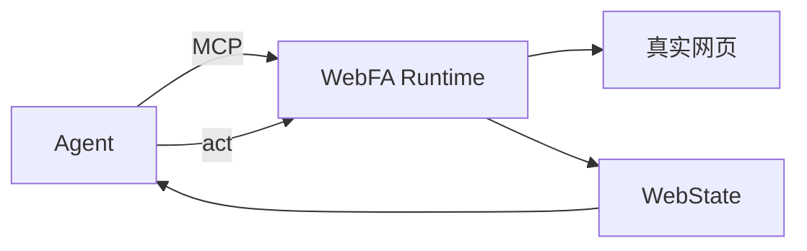

<h1 align="center">
  <picture>
    <source media="(prefers-color-scheme: dark)" srcset="docs/assets/webfa-mark-light.svg">
    
  </picture>
  WebFA
</h1>

<p align="center"><strong>给 Agent 一套原生的互联网运行时</strong></p>
<p align="center">让 Agent 作为一等互联网用户，感知、操作并验证真实网页</p>

<p align="center">
  <a href="LICENSE"></a>
  <a href="https://www.python.org/"></a>
  <a href="https://modelcontextprotocol.io/"></a>
  
</p>

<p align="center">
  <a href="#快速开始">快速开始</a> ·
  <a href="README.en.md">English</a> ·
  <a href="#工作原理">工作原理</a> ·
  <a href="#安全边界">安全边界</a> ·
  <a href="#文档">文档</a>
</p>

---

WebFA 是一个本地运行的 **agent-native browser runtime**：给 agent 一套原生的网页访问接口，让 agent 像真实互联网用户一样浏览、操作和验证网页。

```text
agent -> webfa.open_url -> webfa.observe -> webfa.act -> webfa.observe
```

Agent 负责决策，WebFA 负责执行：打开真实网页、在隔离 Profile 中维护网站登录身份、返回结构化页面状态、执行语义化网页操作。人类预览 UI 不是产品目标；仓库里仍有遗留 Desktop / Monitor 代码，不作为能力宣传。

当前状态：**Developer Preview**，API 和行为仍可能变化。

## 为什么需要 WebFA？

Agent 已经能写代码、改文档、做决策；但要它像真人一样使用互联网，常见两条路都会走偏：

| 常见做法 | 结果 |
| --- | --- |
| 传统浏览器 + 自动化 | Agent 面对 DOM、selector、坐标和 CDP，页面一变就碎 |
| 站点专用 API / wrapper | 不是通用上网，也不是真实网页用户 |
| 以人类浏览器 UI 为中心 | Agent 依赖给人看的界面，而不是自己的运行时 |

WebFA 把引擎、Chrome UI、DOM、selector、CDP 留在实现层，把 **网页对象、语义操作、结构化状态** 交给 Agent。

WebFA **不是**：传统浏览器加自动化、站点 API wrapper 的集合、内置智能体的桌面应用。

## 工作原理

Agent 面对的是**网页对象**，不是 DOM：

```text
真实网页 -> WebObjectCompiler -> WebState（WebObjects / Capabilities）-> Agent 语义操作
```



`webfa.observe` 返回结构化的 `WebState`：可操作的网页对象、对象状态与关系、可用操作、文档版本和变更集。`webfa.act` 只接受对象声明的语义操作（如 `open`、`set_value`、`submit`、`choose`）。DOM、selector、坐标、鼠标键盘事件、CDP 都是 Runtime 内部实现，不进入公共协议。完整设计见 `docs/P10_WEBFA_OBJECT_MODEL_DESIGN.md`。

## 快速开始

环境要求：Python 3.12+，本机安装 Chrome 或 Edge。

```powershell
python -m venv .venv
.\.venv\Scripts\activate
pip install -e ".[dev]"
webfa doctor        # 本地自检
```

生成 MCP 配置接入你的 agent：

```powershell
webfa mcp-config --agent-id <your-agent-name>
```

Agent 通过 MCP stdio 连接后，`webfa-mcp` 会自动复用或启动本地 Runtime（默认 `http://127.0.0.1:8787`），无需手动管理进程。各 agent 应使用独立的 `WEBFA_AGENT_ID`；不同 Profile 可以由不同 agent 并发使用。

接入指南：[opencode](docs/agent-integrations/opencode.md) · [Kimi Code](docs/agent-integrations/kimi-code.md) · [Claude Code](docs/agent-integrations/claude-code.md) · [Codex](docs/agent-integrations/codex.md)

## 登录与人工接管

Agent 不应该输入密码、验证码或 2FA。登录态用 CLI 预置；当页面需要人类认证时，Runtime 停在机械安全边界上，而不是依赖一套人类预览 UI 来完成任务。

预置登录：

```powershell
webfa login github
webfa login --url https://example.com/login
```

高风险认证仍要求人类在真实页面上完成，然后 Agent 重新 `observe`。人类预览 UI / Session Monitor 不是产品目标。

## 能力一览

| 能力 | 说明 |
| --- | --- |
| 5 个 MCP 工具 | `open_url`、`observe`、`act`、`get_tabs`、`switch_tab`，不多不少 |
| Managed Chromium | 每个 Profile 独立的浏览器身份目录，不依赖 Playwright |
| 多 Profile | 不同 Profile 可并发；同一 Profile 同时只允许一个可写 Session |
| Profile Bootstrap | 人工登录、Cookie 导入、加密 `.webfa-profile` 身份包的导出与恢复 |
| 安全回执 | 高风险操作受 SafetyContext、Runtime 证据约束；超出自治边界才触发精确作用域、默认单次使用的 Step-up |

## 安全边界

默认不向 agent 暴露：

| 不暴露 | 原因 |
| --- | --- |
| cookies / localStorage / sessionStorage | 登录凭据不属于 Agent 协议 |
| token 与 authorization header | 避免把身份材料交给模型 |
| 密码值 | Agent 不负责输入密钥 |
| 完整 DOM / HTML | Agent 使用 WebState，不是原始页面源码 |
| selector / XPath / evaluate | 没有逃生口去操作实现细节 |
| raw CDP | 浏览器协议不进入公共契约 |

详见 `docs/P11_AGENT_SAFETY_CONTRACT_DESIGN.md`。

## 当前限制

- 同一 Profile 同时只有一个可写 Session（不同 Profile 可并发）。
- 不绕过反爬、验证码、风控或平台安全系统。
- `open_url` 和链接打开属于导航语义；如果网站滥用 GET 导航产生外部写入，Runtime 无法仅凭协议确定该业务副作用。
- 活跃 Session 和任务执行状态不跨 Runtime 重启保留；没有耐久任务恢复，也不再作为独立阶段规划。
- 人类预览 UI 不是产品目标。仓库里的 Desktop / Monitor 是遗留开发者面，不是完整浏览器，也不包含内置 Agent。

## 开发

```powershell
python -m pytest -q          # Python 测试
npm install                  # 可选：人类控制面（Renderer + Electron）
npm run dev                  # 启动 Visualizer，默认 http://127.0.0.1:8788
npm run typecheck:renderer
npm run typecheck:electron
```

常用环境变量见 `.env.example`；源码运行时数据默认存放在 `%APPDATA%\WebFA`。

## 文档

- 路线图：`docs/browser-runtime-roadmap.md`
- Object Model 设计：`docs/P10_WEBFA_OBJECT_MODEL_DESIGN.md`
- 安全契约设计：`docs/P11_AGENT_SAFETY_CONTRACT_DESIGN.md`
- 多 Session / 多 Profile 设计：`docs/P12_MULTI_SESSION_MULTI_PROFILE_DESIGN.md`
- 遗留桌面分发说明（不是产品目标）：`docs/DESKTOP_DISTRIBUTION_ARCHITECTURE.md`
- 开源 Runtime 就绪状态：`docs/OPEN_SOURCE_READINESS.md`
- 候选发布门禁：`RELEASE_CHECKLIST.md`
- 当前基线：`docs/reports/CURRENT_BASELINE.md`
- 历史报告阅读须知：`docs/reports/README.md`（旧报告只代表当时的工程证据）

## License

MIT，见 [`LICENSE`](LICENSE)。
